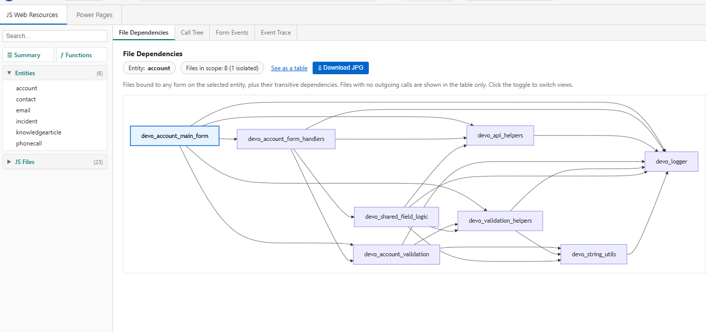
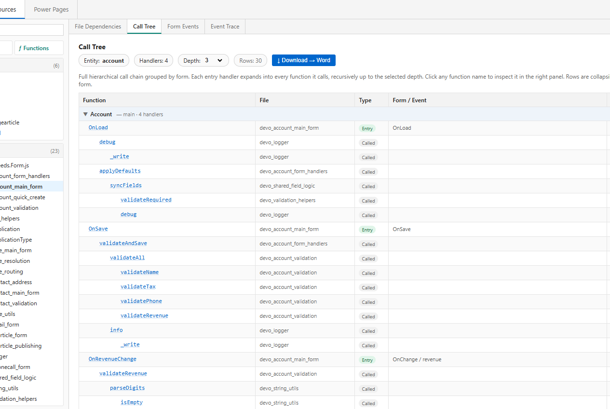
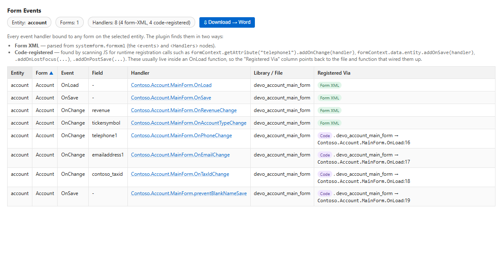
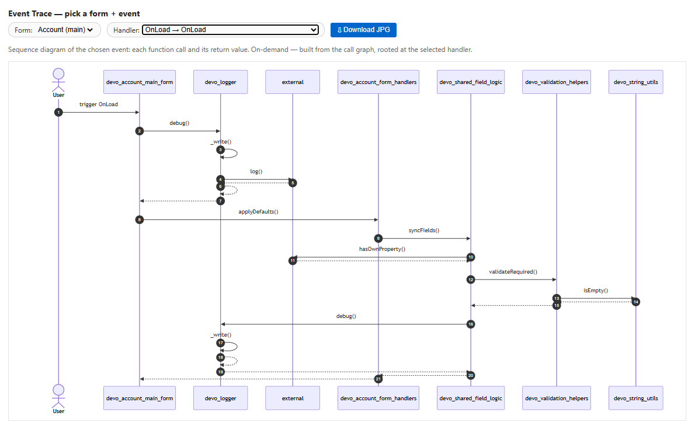
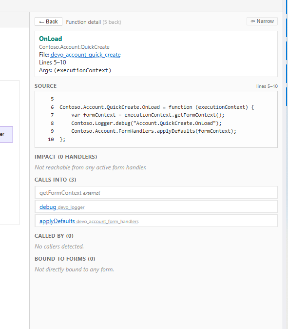
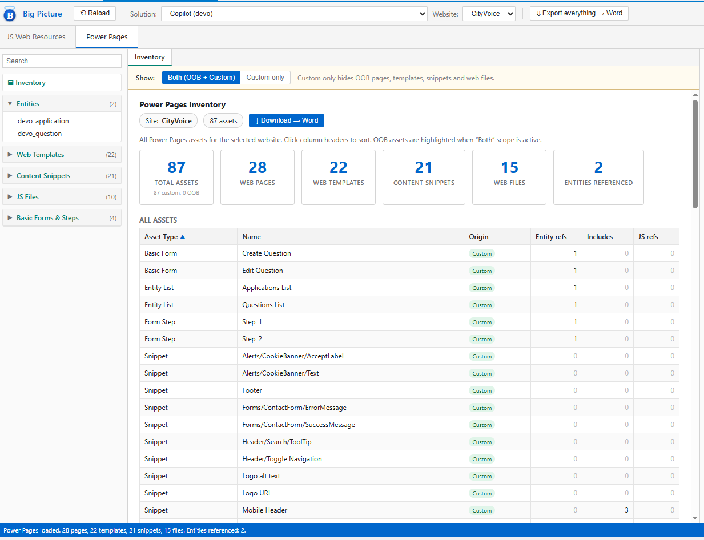

# Big Picture — XrmToolBox Plugin

**Big Picture** is a read-only analysis tool for Dataverse developers. It maps the relationships between JavaScript web resources, model-driven app forms, and Power Pages assets in a single solution — giving you the "big picture" of your frontend code without having to open dozens of browser tabs.

> **Requires** XrmToolBox 1.2025.7+ and WebView2 Runtime (ships with Edge / Windows 11).

---

## Table of Contents

1. [Getting Started](#1-getting-started)
2. [JS Web Resources Tab](#2-js-web-resources-tab)
3. [Power Pages Tab](#3-power-pages-tab)
4. [Export, Tips & Troubleshooting](#4-export-tips--troubleshooting)

---

## 1. Getting Started

### Installation

Install directly from the **XrmToolBox Plugin Store** — search for *Big Picture* and click Install. After restarting XrmToolBox the plugin appears in the tool list.

### First run

1. Open XrmToolBox and connect to a Dataverse environment using the standard connection bar.
2. Launch **Big Picture** from the tool list.
3. The toolbar loads automatically. Pick a **Solution** from the dropdown — Big Picture scopes everything to that solution.
4. If you also want Power Pages analysis, switch to the **Power Pages** tab and pick a **Website** from the second dropdown.

> Data is loaded once per solution/website. Use the **⟲ Reload** button to refresh after making changes in your org.

### What Big Picture reads

Big Picture makes **read-only** calls to Dataverse. It never creates, updates, or deletes records. The tables it queries are:

| Tab | Tables read |
|---|---|
| JS Web Resources | `webresource`, `systemform`, `solutioncomponent`, `solution`, `publisher` |
| Power Pages | `mspp_website`, `mspp_webtemplate`, `mspp_contentsnippet`, `mspp_webpage`, `mspp_webfile`, `annotation`, `mspp_entityform`, `mspp_webformstep`, `mspp_entitylist`, `solutioncomponent`, `solution` |

All data stays within XrmToolBox — nothing is sent to any external server. Mermaid diagrams are rendered using a CDN library (`cdn.jsdelivr.net`); an internet connection is required for diagram views.

### The layout

```
┌─ Toolbar ────────────────────────────────────────────────────────┐
│  ⟲ Reload  Solution: [dropdown]  Website: [dropdown]  ⇩ Export  │
├─ Tabs ───────────────────────────────────────────────────────────┤
│  JS Web Resources  |  Power Pages                                │
├─ Left panel ─────────┬─ Centre (views) ────────┬─ Right panel ──┤
│  Search              │  Sub-tabs               │  Entity detail  │
│  Entities / Files    │  Main content area      │  Function detail│
└──────────────────────┴─────────────────────────┴────────────────┘
```

- **Left panel** — browse and select items (entities, files, templates, snippets, forms).  
- **Centre** — sub-tabs switch between analysis views for the selected item.  
- **Right panel** — drilldown detail when you click a function or file name. Use **⇔ Widen** to expand it.

---

## 2. JS Web Resources Tab

Select a solution and choose an **entity** from the left panel. Big Picture finds all forms bound to that entity, traces which JavaScript files they load, and parses every function and call in those files.

### 2.1 File Dependencies

*Sub-tab: File Dependencies*

Shows a **flowchart** of which JS files depend on which others, rooted in the entry files that are registered on your forms.

- **Entry files** (blue) — directly loaded by a form handler.
- **Helper files** (grey) — called by entry files but not directly form-bound.
- **Orphan files** — not reachable from any form; shown in the Summary instead.

Toggle the link in the toolbar to switch between the diagram and a plain table when you have many files.



### 2.2 Call Tree

*Sub-tab: Call Tree*

A hierarchical view that starts from every enabled form handler and expands the full chain of function calls, up to the selected depth (1–5 or Max). Grouped by form.

- Click any function name to open its **Function Detail** in the right panel.
- Use the **Depth** selector to control how deep the tree goes — "Max" finds cycles and very deep chains.



### 2.3 Form Events

*Sub-tab: Form Events*

A flat table of every event handler across all forms for the entity — both:

- **Form-XML registered** — declared in `<Events>/<Handlers>` in the form definition.
- **Code-registered** — discovered by scanning JS for runtime calls such as `formContext.getAttribute("field").addOnChange(handler)` or `formContext.data.entity.addOnSave(handler)`.

Columns: Entity, Form, Event, Field, Handler function, Library file, Registered via.

Click any handler name to inspect it in the right panel.



### 2.4 Event Trace

*Sub-tab: Event Trace*

Pick a specific form and handler from the dropdowns to see a **Mermaid sequence diagram** of the full execution path — every function called in sequence from that entry point.

Automatically switches to a table when there are more than 10 participants (sequence diagrams become unreadable at that scale).



### 2.5 Summary (global view)

Click **☰ Summary** at the top of the left panel (not tied to a specific entity).

Shows aggregate stats across the whole solution:

| Card | What it tells you |
|---|---|
| JS Files | Entry / helper / orphan breakdown |
| Forms | Count of in-solution forms and entities |
| Functions defined | Total parsed across all files |
| Calls detected | Total inter-function calls found by the parser |
| Form handlers | Count of form-XML registered handlers |
| Code-reg. handlers | Count of `addOnChange` / `addOnSave` style registrations |

**Most-imported helpers** — which files are depended on by the most other files (your shared utility libraries).

**Orphan files** — files in the solution that are never loaded by any form and not called by any other file. Candidate dead code.

**Potentially unreachable functions** — functions in non-orphan files that are not reachable from any enabled form handler via BFS. Also candidate dead code, though they may be called dynamically or from external scripts not in the solution.

### 2.6 All Functions (global view)

Click **ƒ Functions** at the top of the left panel.

Every function across all parsed JS files in a single sortable table. Filter by name/namespace and scope to Entry / Helper / Orphan functions. Click any function name to open its detail in the right panel.

### 2.7 Function Detail (right panel)

Clicking a function name from any view opens the **Function Detail** pane on the right:

- **Source snippet** — the function body with line numbers (first 3000 chars).
- **Impact** — which form events are transitively affected if this function changes (BFS upward through the call graph).
- **Calls into** — functions this function calls (clickable, navigates deeper).
- **Called by** — functions that call this one (clickable, enables upward traversal).
- **Bound to forms** — forms where this function is directly registered as a handler.

Use **← Back** to retrace your navigation path. History is preserved until you select a different entity.


---

## 3. Power Pages Tab

Switch to the **Power Pages** tab and choose a **Website** from the toolbar dropdown. Big Picture fetches all assets for that site and builds a cross-reference index.

### 3.1 Inventory (global view)

Click **⊐ Inventory** at the top of the left panel.

A summary dashboard for the whole website:

- **Cards** — total asset count, page count, template count, snippet count, file count, and entity reference count.
- **All Assets table** — every asset with its type, name, origin (OOB / Custom), entity reference count, include/snippet reference count, and JS reference count.

Use the **Show: Both / Custom only** scope bar to hide managed (OOB) rows.



### 3.2 Entity Usage

*Left panel section: Entities | Sub-tab: Entity Usage*

Select an entity name to see every Power Pages asset that references it — via Liquid `entity_logical_name` tags, FetchXML `<entity>` nodes, or form/list bindings. Columns: Asset Type, Name, Origin.

### 3.3 Template Include Graph

*Left panel section: Web Templates | Sub-tab: Template Graph*

Select a web template to visualise its full `` / `` hierarchy:

- **Above** the selected node — templates this template depends on (its parents).
- **Below** the selected node — assets (pages, other templates) that include this template.

Arrows flow top-to-bottom: dependency → consumer.

The diagram auto-renders for up to 20 nodes. Toggle to **table mode** for larger graphs or to enable export. OOB templates are styled in grey; the selected template is highlighted in blue.

### 3.4 Dependencies

*Sub-tab: Dependencies*

Available for Web Templates, Content Snippets, and JS Files. Shows every asset that references the selected item — as a Mermaid flowchart (up to 10 usages) or a table. Toggle between the two views using the link in the toolbar.

### 3.5 Snippet Cross-Reference

*Left panel section: Content Snippets | Sub-tab: Cross-Reference*

Select a content snippet to see:

- **Grouped usage** — assets that reference this snippet, organised by asset type (Web Templates, Web Pages, Basic Forms, Form Steps, Entity Lists).
- **Co-referenced snippets** — other snippets that tend to appear alongside this one in the same assets, sorted by frequency. Useful for identifying snippet families.

### 3.6 Web File References

*Left panel section: JS Files | Sub-tab: Web File References*

Select a JS web file to see every template, page, and form that references it via `<script src>` tags or the form JavaScript field.

### 3.7 JS Call Graph

*Left panel section: JS Files | Sub-tab: JS Call Graph*

Select a JS web file to see its parsed functions, with call relationships displayed as chips:

- **Calls** — functions this function calls (within the same file's parsed context).
- **Called by** — other functions in the file that call this one.

### 3.8 Form Script Analysis

*Left panel section: Basic Forms & Steps | Sub-tab: Form Scripts*

Select a basic form or form step (prefixed with `[Step]`) to analyse its registered startup JavaScript (`mspp_registerstartupscript`). Shows the same function table as the JS Call Graph.

Big Picture also scans the **Instructions** (`mspp_instructions`) and **Success Message** (`mspp_successmessage`) HTML fields for `<script src>` tags and Liquid snippet references — these feed into the Entity Usage, Web File References, and Snippet Cross-Reference views even when the form has no startup script.

---

## 4. Export, Tips & Troubleshooting

### Exporting results

Every view supports export:

| Export option | How to trigger |
|---|---|
| Download table → Word | Click the **⇩ Download → Word** button in the view toolbar |
| Download diagram → JPG | Click the **⇩ Download JPG** button (diagram views only) |
| Export everything | Click **⇩ Export everything → Word** in the main toolbar — produces one Word document with every table from all views in the current session |

Word exports include a heading for each table and are formatted for easy copy-paste into design documents or impact assessments.

### Scope filter

The **Show: Both / Custom only** toggle (Power Pages tab) hides OOB (managed) assets from the left panel and all content tables. Use *Custom only* when you want to focus on code you own.

### Search

The search box at the top of the left panel filters the displayed items in all sections simultaneously. Clears automatically when you switch tabs.

### Performance tips

- Big Picture pages through Dataverse in batches of 500. Large orgs with thousands of web resources may take 10–30 seconds to load. Use ⟲ Reload sparingly.
- The Summary and Functions global views scan the entire parsed inventory — they are intentionally computed on demand and do not affect load time.
- Diagram views require an internet connection to render (Mermaid CDN). If diagrams appear blank, check your network or toggle to table mode.

### OOB vs Custom

Assets in managed solutions are labelled **OOB** (out-of-the-box). These are read-only in Dataverse and cannot be modified without an unmanaged layer. Big Picture displays them so you can understand dependencies but highlights them distinctly so you can focus on custom code.

### Troubleshooting

| Symptom | Likely cause | Fix |
|---|---|---|
| "No org connected" in status bar | XrmToolBox not connected | Use the XrmToolBox connect button |
| Solution dropdown empty | No visible solutions found | Ensure the connected user has read access to `solution` |
| PP tab shows no websites | No `mspp_website` records or no access | Verify Power Pages is provisioned and the user has read rights |
| Diagrams don't render | No internet / CDN blocked | Toggle to table mode; diagrams require `cdn.jsdelivr.net` |
| Form steps missing | `mspp_webformstep` table not accessible | Verify user has read access to Power Pages tables |
| Some asset types show ⚠ warning | Fetch error for that table | Hover over the status bar message for details; the rest of the inventory still loads |
| JS Call Graph is empty for a web file | File has no parsed functions | The parser works on plain JS; minified or bundled files may produce zero results |

### Security & privacy

Big Picture is **read-only**. It calls `RetrieveMultiple` and `Retrieve` only — it never calls `Create`, `Update`, `Delete`, or any action message. It does not transmit any data outside of your XrmToolBox session. The only external network request is loading the Mermaid diagram library from `cdn.jsdelivr.net` at startup.

The plugin reads **developer assets** (JavaScript source code, Liquid templates, form XML, snippet HTML) — it does not read business records such as accounts, contacts, or any entity that holds customer data.

Settings (last selected solution, entity, tab, and website) are persisted locally by XrmToolBox's settings manager and are never sent anywhere.

---

## ⚠️ Disclaimer

### Provided "AS-IS"

This tool is provided **as-is**, without warranty of any kind — express, implied, or statutory — including but not limited to warranties of merchantability, fitness for a particular purpose, or non-infringement.

### Use at Your Own Risk

Use of Flow King is entirely **at your own risk**. The author and contributors accept no responsibility or liability for any loss, damage, data corruption, disruption to service, or any other consequence — direct or indirect — arising from the installation or use of this tool.

### Read-Only by Design

Flow King is a **read-only analysis tool**. It does not create, update, or delete any records in your Dataverse environment. It retrieves flow definitions for display and analysis purposes only. Nevertheless, you are encouraged to test in a non-production environment before using in any critical context.

### Best Efforts

Every reasonable care has been taken in the development of Flow King to ensure accuracy of the information displayed and the reliability of the analysis performed. However, the flow parsing and health-check logic is based on the Power Automate internal JSON format, which may change with platform updates. Results should be used as a **guide and starting point** for your own assessment, not as a definitive or authoritative source.

### XrmToolBox Community Standard

Flow King is a community plugin distributed through XrmToolBox. It is subject to the standard [XrmToolBox disclaimer](https://www.xrmtoolbox.com/privacy-policy/):

> *XrmToolBox plugins are developed and maintained by independent contributors. Microsoft, the XrmToolBox team, and the individual plugin authors make no guarantees about the suitability, accuracy, or fitness of any plugin for any purpose.*

---

## Author

**Manny Grewal**

---

## License

This project is provided for use within the XrmToolBox ecosystem. Please refer to the repository licence file for full terms.